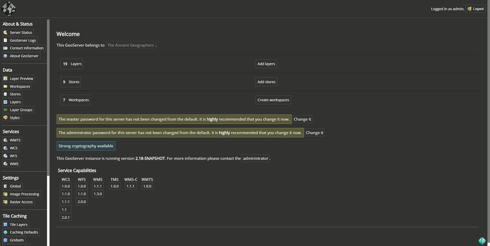

#  GeoServer Custom Theme

Unpacked browser extension to swicth GeoServer style to a custom theme.
This repository is an exercise to play around with scss and browser extensions so probably the custom styles are not complete, not working as expected or not aligned with the default ones.

- Light Theme

- Dark Theme

tested with `GeoServer 2.18-SNAPSHOT (2020-05-18)`

## Test/Develop (Chrome)

- clone or download this repository

- navigate to `chrome://extensions/` in the browser

- enable `Developer mode` with the switch button in the top right corner

- click on the `Load unpacked` button on the top left side of the screen

- select the location of the downloaded repository

    - now the extension is loaded

- navigate to a `GeoServer` url that uses the default paths (eg. `http://localhost:8080/geoserver/web/`)

    - now the light theme is active

- click on the toggle button in the bottom right corner of the `GeoServer` page to switch to dark theme

- disable or remove the extesion to back to the default style of `GeoServer`